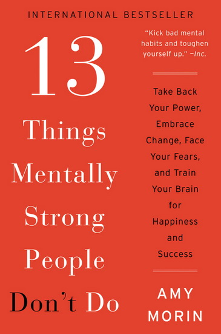

Love secrets oxytocin, dopamine and serotonin. All these hormones equal the 'you're in love'. 'Don't go breaking my heart' by Elton John wasn’t biologically accurate. You can't love with your brain. If Elton John has to really say what he meant, he was saying don't go breaking my brain but that doesn’t sound really nice, does it? I am not denying that love exists or saying that it's simply a meaningless chemical reaction. It surely is a feeling caused by a reaction but there's something else about it that I cannot fathom to put into words. What I know is your heart has no business regarding love but exists to just pump pure blood. What's true is that people's brains are fragile, complex and precious and is subjected to all the 'breaking' Elton John talks about. 

I think I've been mildly attractive to people in my life until now. Fashion, jawlines and physical attributes might not be my strength but I can proudly say that I've never judged a guy based on his looks at first. 'At first' is key in that sentence. Of course, I have eyes and of course jawlines are attractive but what really gets me going is a brain and emotional availability. When someone quotes Dan Brown or tells me really lame jokes it's not 'Feynman Einstein and Schrödinger walk in a bar', it's love. 

This kind of thing surely makes me feel very different from common perceptions of attraction to the body and advocating a mindset of saying 'look at that ass'. I never really got that. I don't mean to disregard or make people seem shallow because, I appreciate a cute butt but I speak for all the geeks out there who get caught off guard by definitions, research questions, conspiracy theories or even their common love for debating a social issue or which is better - Star wars or Star Trek (Star Trek is correct). Scientifically, you guys are superior getting attached to brains and not just muscles. But having said that, you'll fall for whoever you are meant to. It's messed up I know.

I got my heart broken, not a long time ago and yes it sucked. But, I am grateful for the lessons it gave me. I learnt a lot about who I was, how I react in situations and what I want in a partner. It was a calculated risk but I came to the realization that I deserve the best. I might not know what I want, but, I know it's foolish to settle. So its alright to not know what you want, but don’t let anyone treat you any lesser than what you deserve, which is absolutely the fucking best. Someone really smart once told me 'at end of the day it's just you and your problems'. That's true and somewhat comforting, but, also sad. If you've accepted that and made it your reality, people will automatically stop disappointing you, but it doesn't mean you give up hope.

Book recommendation of this week: '13 Things Mentally Strong People Don't Do' by Amy Morrin. Morin elaborates the 13 things from her tried-and-true practices for increasing mental strength to her personal tragedies. Enhancing your mental strength can change your entire life. It takes practice and hard work, but with Morin's specific tips, exercises and troubleshooting advice, it is possible to drastically improve the quality of your life and most importantly, realize that you haven't gotten it half as bad as the other person.

